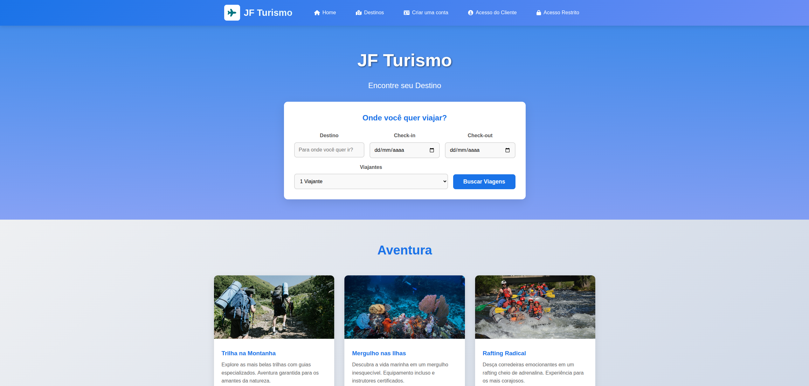

<div align="center">
  <h1>JefTur — Portal de Gestão Turística</h1>
  <p>Sistema web para gestão e divulgação de destinos turísticos</p>
  
  
  <br>
  

  
  
  
  
  
  <br><br>
  
  
  
  
  
</div>

## 📋 Sobre o Projeto

O **JefTur** é uma aplicação web completa para gestão e divulgação de destinos turísticos, desenvolvida como projeto acadêmico na disciplina de **Programação Web** do curso de **Sistemas para Internet**. O sistema simula um ambiente real de gestão turística com interface tanto para clientes quanto para administradores.

### 🎯 Objetivos
- Fornecer uma plataforma intuitiva para busca de destinos turísticos
- Oferecer ferramentas de gestão para administradores
- Implementar boas práticas de desenvolvimento web
- Servir como portfólio acadêmico e técnico

## ✨ Funcionalidades

### ✅ Implementadas
- **Página inicial** do sistema com navegação intuitiva
- **Área do cliente** com múltiplas páginas:
  - Busca e visualização de destinos
  - Página de detalhes dos destinos
  - Fluxo de cadastro e acesso
  - Simulação de pagamento
- **Painel administrativo** com dashboard básico
- **Organização modular** de assets e componentes
- **Design responsivo** para diferentes dispositivos

### 🚧 Em Desenvolvimento
- CRUD completo de destinos turísticos
- Integração entre área administrativa e cliente
- Sistema de validação de formulários
- Melhorias de acessibilidade (WCAG)
- Otimização de performance
- Sistema de busca avançada

## 🏗️ Estrutura do Projeto

```
📦 JefTur/
├── 📁 admin/ # Painel administrativo
│ ├── 📄 dashboard.html # Dashboard principal
│ ├── 📄 dashboard.css # Estilos do dashboard
│ ├── 📄 dashboard.js # Lógica do dashboard
│ └── 📄 login.html # Página de login
│
├── 📁 assets/ # Recursos estáticos
│ ├── 📁 icons/ # Ícones do sistema
│ ├── 📁 images/ # Imagens organizadas por categoria
│ │ ├── 📁 destinos/ # Imagens dos destinos
│ │ ├── 📁 home/ # Imagens da homepage
│ │ └── 📁 logos/ # Logotipos e marcas
│ ├── 📁 css/ # Estilos globais
│ ├── 📁 js/ # Scripts globais
│ └── 📄 config.js # Configurações globais
│
├── 📁 client/ # Área do cliente
│ ├── 📄 acesso.html # Login do cliente
│ ├── 📄 cadastro.html # Cadastro de cliente
│ ├── 📄 destinos.html # Listagem de destinos
│ ├── 📄 detalhes.html # Detalhes do destino
│ └── 📄 pagamento.html # Finalização de compra
│
├── 📄 index.html # Página inicial
├── 📄 README.md # Documentação
└── 📄 .gitignore # Arquivos ignorados pelo Git
```

## 🛠️ Tecnologias Utilizadas

| Tecnologia | Finalidade |
|------------|------------|
| **HTML5** | Estrutura semântica das páginas |
| **CSS3** | Estilização, layout responsivo e animações |
| **JavaScript** | Interatividade e lógica de negócio |
| **Git** | Controle de versão |
| **GitHub** | Hospedagem e colaboração |
| **VS Code** | Ambiente de desenvolvimento |

## 🚀 Como Executar o Projeto

### Pré-requisitos
- Navegador web moderno (Chrome, Firefox, Edge)
- Editor de código (recomendado: VS Code)
- Git (para clonar o repositório)

### Passos para execução

1. **Clone o repositório:**
```bash
git clone https://github.com/robertifpb/JefTur.git
```
2. **Acesse a pasta do projeto:**
```bash
cd JefTur
```

3. Abra no navegador:

- Método 1: Abra diretamente o arquivo index.html

- Método 2 (recomendado): Use a extensão Live Server no VS Code

### ⚙️ Configuração do Ambiente de Desenvolvimento

1. Instale o Visual Studio Code

2. Instale a extensão Live Server

3. Clone este repositório

4. Clique com o botão direito em `index.html` e selecione "Open with Live Server"

## 📱 Navegação

### 👥 Área do Cliente
1. Acesse a página inicial (`index.html`)
2. Navegue pelos destinos em "Destinos"
3. Visualize detalhes de cada destino
4. Faça cadastro ou login para reservas

### 🛠️ Painel Administrativo
1. Acesse `/admin/login.html`
2. Faça login no sistema
3. Acesse o dashboard para gestão

## 👥 Equipe de Desenvolvimento

Projeto desenvolvido por estudantes da disciplina de **Programação Web**, curso de Sistemas para Internet.

### 🧑‍💻 Membros:

- Álex - Desenvolvedor
- Alan - Desenvolvedor;
- Darllan - Desenvolvedor;
- Guilherme - Desenvolvedor;
- Jefferson - Desenvolvedor;
- Luan  - Banco de Dados.

### 🎓 Orientação:

- Professor(a): Izabella Ribeiro

- Instituição: Faculdade EESAP

### 📄 Licença

Este projeto foi desenvolvido para fins acadêmicos e educacionais, destinado exclusivamente ao aprendizado e portfólio técnico.

- Uso: Livre para estudo e referência

- Modificação: Permitida com créditos

- Comercialização: Não permitida

- Responsabilidade: Código fornecido "como está"

## 🤝 Como Contribuir

#### 1. Faça um Fork do projeto

#### 2. Crie uma branch para sua feature (git checkout -b feature/AmazingFeature)

#### 3. Commit suas mudanças (git commit -m 'Add some AmazingFeature')

#### 4. Push para a branch (git push origin feature/AmazingFeature)

#### 5. Abra um Pull Request

## 📝 Padrão de Commits Semânticos

Para manter um histórico de commits organizado e compreensível, utilizamos **Conventional Commits**. Este padrão facilita a leitura do histórico e a geração automática de changelogs.

### 🏷️ Estrutura do Commit
``` bash
<tipo>[escopo opcional]: <descrição>

[corpo opcional]

[rodapé opcional]
```
### 🔧 Tipos de Commits

```
| Tipo       | Emoji | Descrição                                                               | Exemplo                          |
|------------|-------|-------------------------------------------------------------------------|----------------------------------|
| `feat`     | ✨     | Nova funcionalidade                                                     | `feat: adiciona sistema de login` |
| `fix`      | 🐛     | Correção de bug                                                         | `fix: corrige validação do CPF`   |
| `docs`     | 📚     | Alterações na documentação                                              | `docs: atualiza README.md`        |
| `style`    | 🎨     | Mudanças de formatação (espaços, vírgulas, etc) sem alterar lógica      | `style: formata código com prettier` |
| `refactor` | ♻️     | Refatoração de código (sem adicionar funcionalidades ou corrigir bugs) | `refactor: melhora estrutura do módulo` |
| `perf`     | ⚡     | Melhorias de performance                                                | `perf: otimiza consultas ao banco` |
| `test`     | ✅     | Adição ou correção de testes                                            | `test: adiciona testes unitários`  |
| `build`    | 📦     | Alterações no build system ou dependências                              | `build: atualiza dependências`     |
| `ci`       | 🔧     | Mudanças na integração contínua                                         | `ci: configura GitHub Actions`     |
| `chore`    | 🔨     | Tarefas de manutenção geral                                             | `chore: atualiza scripts npm`      |
| `revert`   | ⏪     | Reverte um commit anterior                                              | `revert: reverte alteração X`      |

### 🌍 Escopo (Opcional)
Indica qual parte do projeto foi alterada:
- `feat(admin):` - Funcionalidade na área administrativa
- `fix(client):` - Correção na área do cliente
- `refactor(assets):` - Refatoração nos assets
- `docs(README):` - Alterações no README

### 📋 Exemplos Práticos

**Commit simples:**
```bash
git commit -m "feat: adiciona página de cadastro de destino"
```

## 📞 Contato e Suporte

- Repositório: github.com/robertifpb/JefTur

- Issues: Reportar problema

- Discussões: GitHub Discussions

 <div align="center"> <p>Desenvolvido com 💚 para a disciplina de Programação Web</p> <p>© 2025 JefTur - Todos os direitos educacionais reservados</p> </div> 